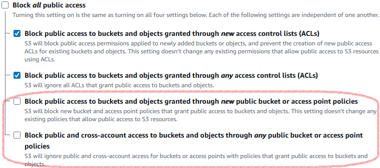
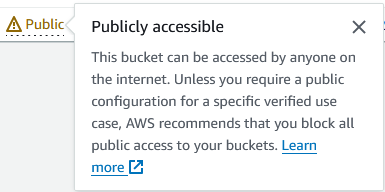
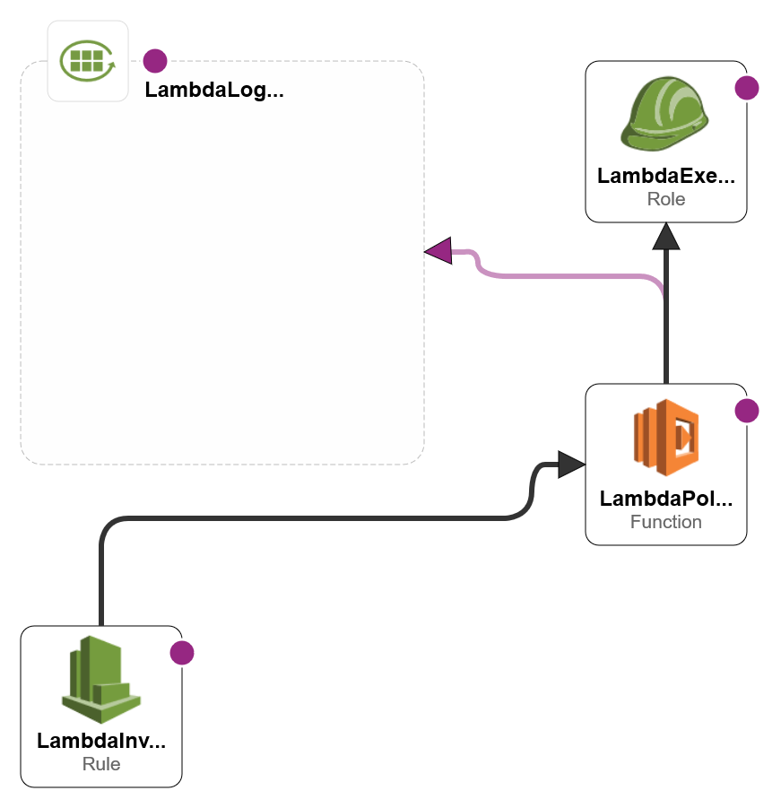

# s3-cloudflare-policy-writer

## Why Would I Need This?

The intent here is to provide:
1. a reusable CloudFormation template that...
2. builds out a Lambda function capable of maintaining...
3. any number of S3 bucket policies to allow...
4. read access to objects within said bucket(s) _only_ from [Cloudflare source IP ranges](https://www.cloudflare.com/ips/)

Ultimately, this would allow hosting of static resources _in_ S3 by way of Cloudflare proxied traffic while _preventing_ direct access to that same S3 bucket outside of Cloudflare.

## How Should I Use This?

Create a new stack in AWS CloudFormation using the [`main.yaml`](main.yaml) template in the root of this repository, and follow the prompts.

> Be sure that you first understand [what resources it will create](#what-does-this-create) and [what options you have in how they are configured](#configuration-options).

Once your stack is created, don't forget to run the Lambda function _at least once_ to create the bucket policies.

## How Does This Work?

The CF template sets up a Lambda function on the [Node.js 20.x runtime](https://docs.aws.amazon.com/lambda/latest/dg/lambda-runtimes.html), using a single CommonJS file with _no package dependencies_. The file itself is minified and written inline into the CF template, and you can see the [unminified source code here](handlers/index.cjs).

<strong>Q</strong>. Why the need for a Lambda to manage the policies, you might ask?

> **A.** Cloudflare may (infrequently) update their published IP ranges, and the function will retrieve the latest list of ranges, compare them against the existing bucket resource policy, and update the policy only as needed.
>
> The same result could be accomplished with a manually created policy (see [generated policy example](examples/generated-policy.json)), which would require manual updates any time Cloudflare changes their published IP ranges.

 

The Lambda function will _create_ the resource policy on the bucket in question if it does not yet exist.

If the bucket policy exists and already contains unrelated policy statements, _only_ the specific Cloudflare policy statement will be added or updated, leaving any other statements as they are.

### Bucket Management &mdash; Things to Note

On "Block Public Access" bucket settings

> When [blocking of all public access](https://docs.aws.amazon.com/AmazonS3/latest/userguide/configuring-block-public-access-bucket.html) to a bucket is enabled, the Lambda will be _unable to put any changes to that bucket's policy_, in the form of an `AccessDenied` error.
>
> In order to update the allowed Cloudflare IP ranges from the Lambda, you will need to **disable blocking through public bucket policies**, found under the bucket's Permissions tab:
>
> 
>
> S3 will still warn you that the bucket may be publicly accessible, but the managed bucket policy statement will _deny access_ to any IP outside of Cloudflare's ranges.
>
> 

 

On buckets across different regions

> Initially, buckets in different regions than the Lambda proved problematic. Adding an extra API call to determine each bucket's location has seemed to fix the issue but adds a second or two to the function running time.
>
> Static website hosting does not appear to matter either way, though **directory buckets** are a whole other matter and may not be supported.

## What Does This Create?

Deploying the CloudFormation template should create 3-4 initial resources, depending on the template parameters you provide:

1. an execution role for the Lambda function
    - an (inline) policy for this role that enables
        - basic lambda permissions (creating log stream, putting log events)
        - basic S3 policy permissions (getting, putting and deleting bucket policies, getting policy status)
2. a Lambda function (named `writeS3PolicyForCloudflare` by default) that uses this execution role
3. an (optional) EventBridge rule to invoke this function regularly (eg, daily, weekly, monthly or quarterly)
4. a Cloudwatch logging group (named after the function by default)

CloudFormation Designer Diagram

### Configuration Options

The template itself includes the following configurable parameters, used in the noted ways:

1. `FunctionNameParameter` - name of the Lambda function; defaults to `writeS3PolicyForCloudflare`
2. `LogVerboseLambdaParameter` - indicates whether the Lambda should produce verbose debugging output during each run; defaults to `false` (minimal output)
3. `LogRetentionParameter` - days to retain log streams produced by every Lambda execution; defaults to `3` (automatically deleted after three days)
4. `BucketNamesParameter` - comma delimited list of buckets whose resource policies are to be managed; while cross-account management is theoretically possible, **currently any buckets must be owned by the same account as the lambda execution role**
5. `InvokeFunctionOnScheduleParameter` - indicates whether to invoke the Lambda on a recurring schedule; defaults to `false` (no schedule created)
6. `InvocationScheduleParameter` - schedule expression indicating how often to invoke the Lambda; defaults to `cron(0 0 1 * ? *)` (once at midnight UTC on the first of each month)
7. `ProjectTagParameter` - value of the `Project` tag that will be added to each resource the template _directly_ creates; defaults to `s3-cloudflare-policy-writer`
    - note that EventBridge rules can't currently be tagged via the creating CF template

## Who Built This?

That would be me, [Evan S Kaufman](https://evanskaufman.com/). I am a tech generalist, and a web developer by trade.
